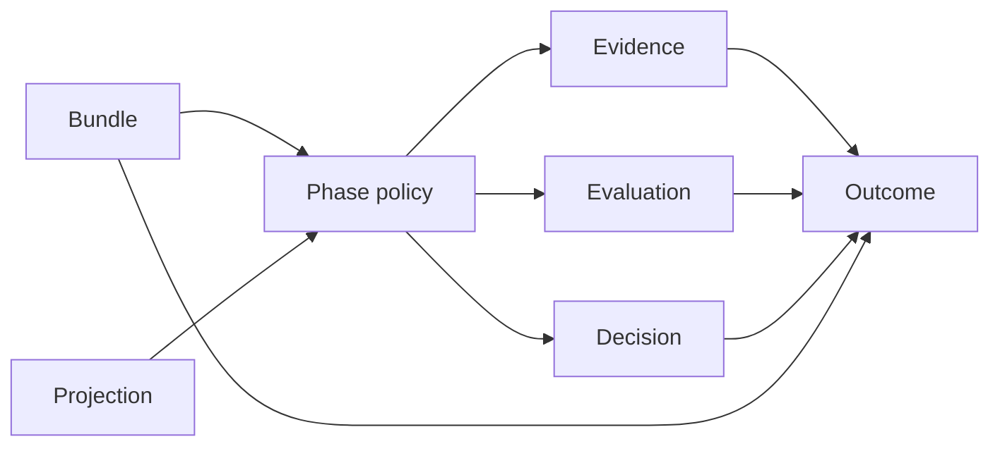
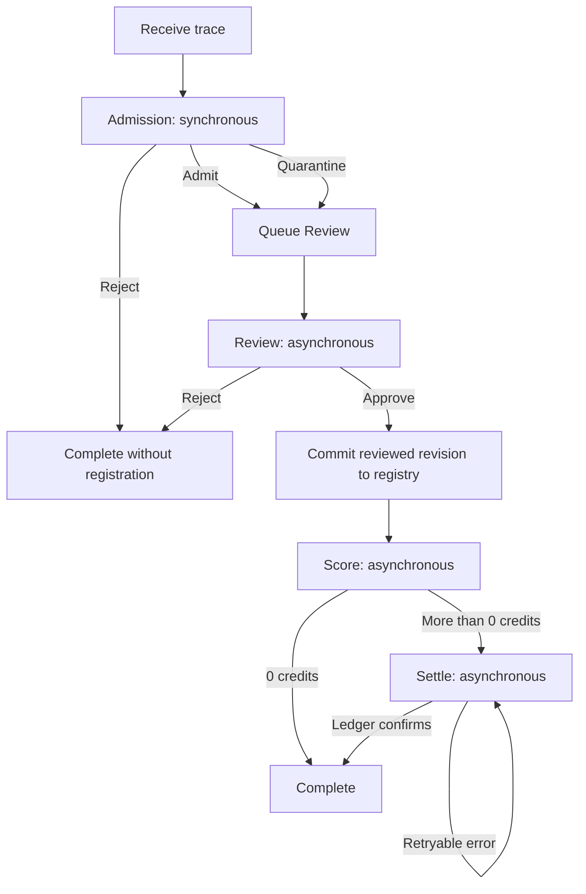
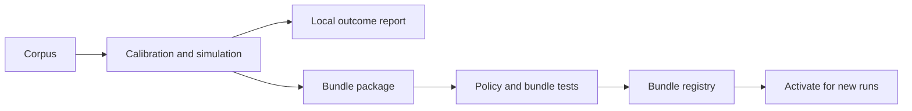

# Versioned Pipeline Processing Design

> A small model for processing traces, explaining outcomes, and changing policy safely.

- **Status:** Proposed target design
- **Date:** 2026-09-08
- **Scope:** Domain model, workflow, persistence, policy development, and rollout

## Review guide

This iteration replaces the previous independent-workflow design with one
pipeline and four phases:

1. Admission
2. Review
3. Score
4. Settle

One immutable bundle selects all four policies. Each phase stores one outcome.
The outcome contains the decision, the evidence, and the evaluation.

The design does not add durable observations, facts, deployment assignments,
effect records, vector epochs, or a generic schema registry.

## 1. Goals

The design has four goals:

- Explain why a trace produced each pipeline outcome.
- Let multiple participants value a trace.
- Make each policy and complete bundle easy to test.
- Keep policy development separate from policy execution.

The design does not require deterministic replay. An outcome must explain past
behavior, even when its external inputs are no longer available.

The design does not define one true value for a trace. A Score policy combines
one or more valuations into the credit decision for its bundle.

## 2. Domain model

The design uses seven domain concepts.

### Phase

A **phase** is one step in the pipeline:

- **Admission** decides whether processing can continue.
- **Review** transforms and approves the trace for the registry.
- **Score** assigns credits from one or more valuations.
- **Settle** applies the assigned credits to a ledger.

### Policy

A **policy** is the versioned implementation of one phase. Examples include:

- An Admission policy that accepts every valid request.
- A Review policy that removes PII.
- A Score policy that assigns a fixed amount.
- A Score policy that aggregates valuations from several participants.
- A Settle policy that writes to a local or external ledger.

Each policy owns its internal algorithm and dependencies. An observer, scorer,
embedder, or vector index is a policy dependency, not a durable domain concept.

### Bundle

A **bundle** is the complete pipeline configuration. It selects one policy for
each phase and all immutable deployed inputs for those policies.

One bundle processes one pipeline run. A policy change creates another bundle.
An active bundle change affects new runs only.

### Projection

A **projection** is the versioned input that a policy gives to an observer.
It has no independent record or lifecycle. Its identifier and input hash appear
in evidence when they affect a decision.

### Decision

A **decision** is the typed result of a phase:

```rust
enum AdmissionDecision {
    Admit,
    Quarantine { reason: ReasonCode },
    Reject { reason: ReasonCode },
}

enum ReviewDecision {
    Approved { registry_revision_id: RevisionId },
    Rejected { reason: ReasonCode },
}

struct ScoreDecision {
    credits: u64,
}

struct SettleDecision {
    credits: u64,
    ledger_receipt_ref_hash: ContentHash,
}
```

An operational error is not a decision. The run remains retryable or moves to
a failed state with a safe error label.

### Evidence

**Evidence** records the state that the policy used. Evidence can contain:

- Rate-limit state and PII findings for Admission.
- The source revision and transformation report for Review.
- Participant valuations and signed-attestation hashes for Score.
- The Score outcome and ledger response reference for Settle.

Large or sensitive evidence stays in encrypted object storage. The outcome
contains bounded values and content hashes.

### Evaluation

An **evaluation** explains how the policy mapped its evidence to its decision.
It uses structured fields and stable reason codes, not free-form prose.

For example, Score evidence can contain five valuations. Its evaluation can
record that three valid valuations produced a median of 200 credits.

### Outcome

An **outcome** is the immutable record that groups these concepts:

```rust
struct Outcome<D, E, V> {
    outcome_id: OutcomeId,
    tenant_id: TenantId,
    run_id: RunId,
    trace_id: TraceId,
    phase: Phase,
    bundle_id: BundleId,
    outcome_schema: SchemaRef,
    decision: D,
    evidence: E,
    evaluation: V,
    recorded_at: DateTime<Utc>,
}
```

One outcome schema identifies the three payload types for a policy family. The
`bundle_id` resolves the exact deployed policies and configuration.

This diagram shows the complete reasoning boundary:



## 3. Bundle identity

A bundle manifest names the deployed inputs that can change a decision:

```rust
struct BundleManifest {
    format_version: u32,
    admission: PolicyRef,
    review: PolicyRef,
    score: PolicyRef,
    settle: PolicyRef,
}

struct PolicyRef {
    policy_id: PolicyId,
    code_artifact_hash: ContentHash,
    configuration_hash: ContentHash,
    data_artifact_hashes: Vec<ContentHash>,
    projection_ids: Vec<ProjectionId>,
}

impl BundleManifest {
    fn to_bundle_id(&self) -> BundleId {
        BundleId::from_hash(canonical_hash(self))
    }
}
```

Configuration includes thresholds and other parameters. Data artifacts include
models, bootstrap data, and fixed reference data when a policy uses them.

The bundle package contains the manifest and deployable artifacts. The ingest
service makes sure that the package matches its bundle identifier before use.

An outcome stores only the bundle identifier. The bundle registry retains the
package. The policy lab retains development runs and reports that produced the
bundle.

The bundle hash excludes mutable external state. A policy records the exact
external state that it reads as evidence.

Golden tests protect bundle identity. A change to code, configuration, data, or
projection identity must change the bundle identifier.

## 4. Workflow

The server binds the active bundle when it creates a run. Every phase in that
run uses the same bundle.



### Admission

Admission runs in the request path. It uses only bounded local work so that it
can complete before the response.

The policy can reject a request because of rate limits. It can quarantine a
trace because of synchronous PII risk. It can also admit a valid trace.

Admission can read indexes but cannot make external writes. This restriction
makes a repeated request safe before its outcome commits.

The evidence stores the hashes of any index, detector configuration, or
projection that affected the decision. Audit logs repeat hashes and safe labels
only.

An admitted trace still passes through Review. Quarantine requires Review to
address the Admission reason before approval.

### Review

Review runs asynchronously. It transforms the stored trace before the server
commits the approved revision to the registry.

A static Review policy can pass the trace through during tests. A production
policy can scrub PII or apply another required transformation.

The Review outcome identifies the source revision, transformation evidence,
and approved registry revision. A rejected trace does not enter the registry.

### Score

Score runs after Review approves the registry revision. It determines the
credit amount, not an objective value for the trace.

A Score policy can use:

- A fixed amount.
- One trusted external valuation.
- Several independent valuations.
- An auction or another aggregation rule.

The outcome records each used valuation as evidence. Each participant uses a
hash-only reference and an attestation hash.

An external valuation is a signed claim:

```rust
struct ValuationClaim {
    tenant_id: TenantId,
    reviewed_revision_hash: ContentHash,
    bundle_id: BundleId,
    score_policy_id: PolicyId,
    round_id: ValuationRoundId,
    credits: u64,
    participant_key_id: KeyId,
    nonce: Nonce,
    expires_at: DateTime<Utc>,
}
```

The Score phase creates its round before it requests valuations. A retry
resumes that round and retains its deadline.

The bundle defines permitted signers, quorum, ranges, duplicate-signer rules,
late-response behavior, aggregation, and deterministic tie handling. The phase
seals one response snapshot before evaluation.

```json
{
  "decision": {
    "credits": 200
  },
  "evidence": {
    "round_id": "valuation-round-42",
    "response_snapshot_hash": "sha256:valuation-snapshot",
    "valuations": [
      {
        "participant_ref_hash": "sha256:participant-a",
        "credits": 150,
        "attestation_ref_hash": "sha256:attestation-a"
      },
      {
        "participant_ref_hash": "sha256:participant-b",
        "credits": 200,
        "attestation_ref_hash": "sha256:attestation-b"
      },
      {
        "participant_ref_hash": "sha256:participant-c",
        "credits": 300,
        "attestation_ref_hash": "sha256:attestation-c"
      }
    ]
  },
  "evaluation": {
    "rule": "median-v1",
    "accepted_valuations": 3,
    "selected_credits": 200
  }
}
```

Missing required valuations cannot produce a favorable default. A trusted-party
policy uses the same claim with a quorum of one. A fixed policy needs no round.

### Settle

Settle runs only when Score assigns more than zero credits. It applies that
amount through the ledger adapter selected by the bundle.

The Score transaction seals a settlement command before any external call. The
command binds the credits, Score outcome, ledger, and beneficiary.

The encrypted artifact store holds sensitive command fields. The run stores its
content hash, opaque artifact identifier, and idempotency key.

The server records the Settle outcome only after the ledger confirms the
credit. A retry uses the sealed command and the same key.

Each ledger adapter must apply or find a command atomically by idempotency key.
The server fails closed when an adapter cannot provide that guarantee.

The outcome stores a hash-only receipt reference. Raw account references and
transaction hashes do not appear in outcomes, audit rows, or logs.

## 5. Policy contracts

Each phase has a small typed policy trait. This example shows the Score phase:

```rust
#[async_trait]
trait ScorePolicy: Send + Sync {
    async fn execute(
        &self,
        input: &ScoreInput,
    ) -> Result<PhaseResult<ScoreDecision, ScoreEvidence, ScoreEvaluation>, PolicyError>;
}

struct PhaseResult<D, E, V> {
    decision: D,
    evidence: E,
    evaluation: V,
}

struct ScoreRunner {
    policy: Arc<dyn ScorePolicy>,
}
```

Admission, Review, and Settle use the same result shape with their own types.
Runners hold policies as trait objects. Policies hold their scorers, embedders,
vector indexes, and ledgers as trait objects.

Tests use small policy implementations through the production trait:

```rust
struct FixedScorePolicy {
    credits: u64,
}

#[async_trait]
impl ScorePolicy for FixedScorePolicy {
    async fn execute(
        &self,
        _input: &ScoreInput,
    ) -> Result<PhaseResult<ScoreDecision, ScoreEvidence, ScoreEvaluation>, PolicyError> {
        Ok(PhaseResult {
            decision: ScoreDecision {
                credits: self.credits,
            },
            evidence: ScoreEvidence::Fixed,
            evaluation: ScoreEvaluation::FixedAmount,
        })
    }
}
```

The design needs no mock-only policy hierarchy. A test implementation satisfies
the same contract as a production implementation.

## 6. Persistence and recovery

The workflow needs two new tables. Existing trace, registry, tenant, and account
storage remains outside this model.

```text
pipeline_runs
  tenant_id, run_id, trace_id, bundle_id
  request_idempotency_key, request_content_hash
  next_phase: admission | review | score | settle | none
  state: pending | leased | retry | complete | failed
  lease_token, lease_expires_at
  attempt_count, next_attempt_at
  last_error_label
  valuation_round_id, valuation_deadline, valuation_snapshot_hash nullable
  settlement_command_ref, settlement_command_hash nullable
  settlement_idempotency_key nullable
  created_at, updated_at
  unique (tenant_id, request_idempotency_key)

phase_outcomes
  tenant_id, outcome_id, run_id, trace_id
  phase, bundle_id
  outcome_schema_id, outcome_schema_version
  decision JSONB
  evidence JSONB
  evaluation JSONB
  recorded_at
  unique (tenant_id, run_id, phase)
```

`pipeline_runs` is mutable queue state. `phase_outcomes` is immutable history.

The receipt path performs these operations:

1. Authenticate the request and derive the tenant.
2. Store the encrypted trace body.
3. Resolve and validate the active bundle.
4. Execute Admission.
5. Commit the run, Admission outcome, and next phase in one transaction.

The request key is unique within the tenant and binds to the request-content
hash. A replay returns the existing run. Reuse with different content fails.

An asynchronous worker performs these operations:

1. Claim a run with a fenced lease.
2. Load the bundle that is already bound to the run.
3. Execute the next phase.
4. Commit its outcome and the next phase in one transaction.

A retry retains the bundle identifier. The unique phase constraint prevents
duplicate outcomes from concurrent workers.

Review stores transformed content by content hash. Its transaction commits the
approved revision, registry entry, outcome, and Score transition together.

Before Score requests external valuations, it commits the round identifier and
deadline. It stores responses in an encrypted artifact and seals its snapshot
hash before evaluation. A retry resumes the same round.

The Score transaction stores the sealed settlement command and its idempotency
key. If confirmation is lost, Settle finds or applies that same command.

Terminal infrastructure errors update the run with a safe label. They do not
create a phase decision or change an earlier outcome.

Each outcome has a stable schema identifier and version for all three payloads.
An incompatible change increments the version and retains the old reader. This
design needs no generic schema registry.

All tenant tables use forced PostgreSQL RLS. The active bundle is tenant-scoped.
Workers set tenant context from the trusted lease result, not envelope fields.

The cross-tenant claimer can update lease columns only. Policy execution,
artifact access, outcome writes, and settlement use a tenant-scoped transaction.

## 7. Policy development

Policy development occurs outside the ingest path.



The existing calibration and pilot-bootstrap tools provide this lab workflow.
A new lab service or lab database is not required by this design.

For an Admission policy, the lab can:

1. Split a selected corpus into bootstrap and holdout sets.
2. Configure the policy and its policy dependencies.
3. Calibrate thresholds against the holdout set.
4. Store a local outcome report.
5. Build a deployable bundle package.

For a Score policy, the lab can compare fixed, trusted-party, and multi-party
valuation rules. Model-based substance and novelty scores remain policy inputs
when a selected Score policy uses them.

The ingest database does not store lab run identifiers or calibration reports.
The lab catalog maps each bundle identifier to those development records.

### Test levels

Policy tests pass typed fixtures directly to one policy.

Phase-runner tests use the normal policy trait with small test implementations.
They cover retry and persistence behavior.

Bundle tests process golden traces through all four policies. They assert the
phase decisions, evidence shape, evaluation shape, and bundle identifier.

Integration tests use a local ledger adapter. Contract tests apply the same
idempotency cases to each external ledger adapter.

## 8. Rollout

The rollout has five steps:

1. Add bundle loading, pipeline runs, and phase outcomes beside current tables.
2. Wrap current behavior in the four policy contracts.
3. Compare new bundle outcomes with current results on a fixed corpus.
4. Activate one bundle for new submissions.
5. Keep old records readable until their retention period ends.

Existing runs finish with their bound bundle. A rollback changes the active
bundle for new runs and does not rewrite old outcomes.

This proposal does not define production reprocessing. Policy development and
comparison use the lab path. A later reprocessing design must prevent repeated
settlement before it can operate in production.

## 9. Required constraints

1. Each run binds one immutable bundle before Admission executes.
2. Each completed phase stores one immutable outcome.
3. Each outcome identifies its phase, trace, run, tenant, and bundle.
4. Evidence records external state that can affect a decision.
5. Evaluation explains the mapping from evidence to decision.
6. Missing required evidence fails closed.
7. Request keys bind to request content and are unique within a tenant.
8. A multi-party Score retry resumes one durable valuation round.
9. Settlement seals its command before an external call and uses one stable
   idempotency key.
10. Authentication supplies tenant scope. Envelope tenant fields provide
   attribution only.
11. Audit rows and logs use hashes and safe labels only.
12. Policy implementations hold scorers, embedders, vector indexes, and ledgers
    behind trait objects.

## 10. Follow-up specifications

Implementation requires four narrow specifications:

- The payload types and reason codes for each phase.
- The bundle package format, signature, and retention policy.
- The external valuation request and attestation protocol.
- The idempotency contract for each settlement adapter.

These specifications can add fields inside the defined boundaries. They do not
add another workflow layer or another provenance model.
