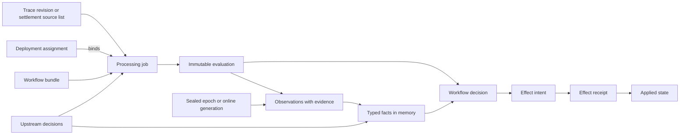
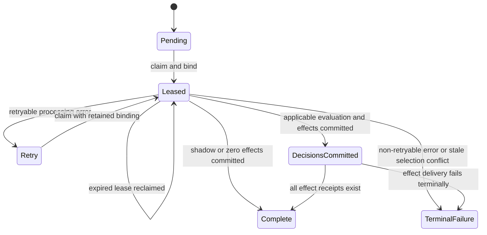

# Versioned Workflow Processing Design

> A durable model for evidence, observations, facts, decisions, and effects.
> The design supports safe retries, controlled reprocessing, independent
> policy evolution, and complete decision provenance.

- **Status:** Proposed target design
- **Date:** 2026-09-07
- **Scope:** Domain model, workflow orchestration, persistence, crate boundaries,
and migration strategy

## Iteration changes

- Recast measurement units as observers and organize processing into Admission,
Review, Commons Qualification, Credit, and Settlement workflows.
- Bring privacy and exact-duplicate checks into immediate Admission; specify
the later privacy backstop, human review, and Credit/Settlement boundary.
- Simplify persistence to observations and decisions with three reference
hashes, and add manifest-checked, workflow-scoped reprocessing.
- Specify independent bundle binding, queue migration, epoch and online index
semantics, narrow job-claim permissions, and the contributor read model.
- Define the lab and enclave boundaries and identify deferred implementation
specifications, including observation checkpoints.


## Contents

1. [Design requirements](#1-design-requirements)
2. [Domain model](#2-domain-model)
3. [Crate architecture](#3-crate-architecture)
4. [Typed contracts and provenance](#4-typed-contracts-and-provenance)
5. [Workflow model](#5-workflow-model)
6. [Persistence and recovery](#6-persistence-and-recovery)
7. [Vector index model](#7-vector-index-model)
8. [Contributor read model](#8-contributor-read-model)
9. [Migration strategy](#9-migration-strategy)
10. [Implementation specifications](#10-implementation-specifications)
11. [System invariants](#11-system-invariants)


## 1. Design requirements

Every result identifies the behavior, projection, model, configuration,
calibration, policy, and evidence that produced it. A deployment assignment
selects production behavior explicitly. Timestamp order does not select the
applicable evaluation or policy.

Observers produce typed measurements. Policies interpret recorded inputs and
produce decisions. Workflow runners coordinate actors, retries, and effects.
These responsibilities have separate version and durability boundaries.

Privacy determines the initial submission state at receipt. Expensive commons
measurements, human assessment, credit eligibility, and settlement have their
own triggers and timing. Each workflow evolves independently and retains
references to the upstream decisions it consumed.

An evaluation is immutable. Reprocessing appends an evaluation with explicit
lineage and compatible input reuse. Mutable job state and contributor views
provide operational projections of this history.

An effect intent is durable before the effect runs. Idempotency keys and
receipts support recovery across database and external-system failures.
Observers can query evidence but cannot change an index or issue credit.

> **Durability principle:** Persist domain results and irreversible boundaries.
> Recompute transient pure work. Record execution detail in logs, traces, and
> metrics.

The design does not require a database event for each internal step, a row for
ad hoc calculations, or one physical backend for all vector roles. Raw trace
bodies, vector arrays, model log probabilities, and neighbor lists stay outside
PostgreSQL. Evolving observation fields use typed JSONB rather than dedicated
SQL columns.

Calibration, model comparison, and affordable repeatable measurement belong to
[the lab crate](#lab-crate). The server records artifact provenance and executes
operator-selected workflow bundles. It does not train models or determine
whether a model is suitable for production.

## 2. Domain model

The reasoning chain has four immutable concepts:

1. **Evidence** identifies the exact trace revision, projection, corpus,
  index epoch or online generation, and other source state used by an
   observation. Its descriptor is stored within the observation.
2. **Observation** records a measurement or an external attestation, its
  producer, schema, evidence, and availability.
3. **Fact** is a typed policy input decoded from observations or referenced
  upstream decisions. Facts preserve availability and source references;
   they are an in-memory view rather than a separate persisted document.
4. **Decision** is the typed result of a pure, versioned policy. It records
  exact input references, disposition, and reason codes.


### Supporting concepts


| Concept               | Responsibility                                                                                                                                           |
| --------------------- | -------------------------------------------------------------------------------------------------------------------------------------------------------- |
| Trace revision        | Immutable reference to one stored form of a trace. Content changes or remediation create another revision. The revision is an input, not an observation. |
| Projection            | Versioned transformation from a stored revision to exact observer input.                                                                                 |
| Observer              | Versioned unit that derives an observation. A scorer is an observer role, not a separate domain type.                                                    |
| Observer artifact     | Manifest of observer behavior, model, configuration, calibration, and projection. Lab-produced artifacts include lab provenance.                         |
| Workflow bundle       | Immutable manifest of one workflow's observer artifacts, primary policy, input manifest, and interpretation contracts.                                   |
| Deployment assignment | Durable, time-bounded selection of a workflow bundle by workflow kind, tenant scope, and active or shadow mode.                                          |
| Processing job        | Mutable coordination record for one workflow run, including its subject, lease, retries, binding, and upstream references.                               |
| Evaluation            | Immutable aggregate of observations and the primary workflow decision, with workflow identity, subject, and provenance.                                  |
| Effect intent         | Durable requested action with immutable payload and mutable delivery state.                                                                              |
| Effect receipt        | Immutable record of successful application, including external identifiers where applicable.                                                             |


An externally attested observation identifies its actor or source and the
procedure that validates it. It does not claim to have been produced by an
observer artifact. Human assessments, signed consent, and governance snapshots
enter policy evaluation through this same observation boundary.

### Relationship diagram




The provenance path for an effect is:

```text
EffectReceipt
  → EffectIntent
  → WorkflowDecision + Policy
  → InputRefs + UpstreamDecisions
  → Observations + Producers
  → Evidence
  → TraceRevision / SourceList + WorkflowBundles + IndexEpoch / OnlineGeneration
```

Evidence references apply to the observations that use them. A Settlement
source list reaches trace revisions and index evidence through its referenced
Credit and Commons Qualification decisions.

## 3. Crate architecture


| Crate                        | Responsibility                                                                                                                                                                                  |
| ---------------------------- | ----------------------------------------------------------------------------------------------------------------------------------------------------------------------------------------------- |
| `trace-commons-gate-api`     | `Observer`, `Policy`, and typed `Evidence` contracts; observation and decision documents; schema registry contracts. Contains no observer or policy implementations.                            |
| `trace-commons-gate-enclave` | Observer implementations within the scoring boundary, including substance, novelty embedding, and similarity-based duplication. Exposes one interface that supports local and remote execution. |
| `trace-commons-lab`          | Calibration corpora, model comparisons, operating-point reports, golden traces, and observer artifact manifests. Executes outside the server.                                                   |
| `trace-commons-server`       | Workflow and effect runners, policy implementations, local Admission observers, registries, deployment assignments, and read models. Consumes workflow bundles by id.                           |


### Lab crate

The lab owns the three-tier measurement harness described in
[Classifier issues: evaluation tiers](classifier-issues.md#principle-2-three-evaluation-tiers-the-cheapest-runs-most-often):

- **Tier 0:** Golden traces and semantic regression checks in CI without a GPU.
- **Tier 1:** Corpus admissibility, missing-input contracts, and policy
operating-point reports in CI.
- **Tier 2:** Bounded, resumable model evaluation on demand, retaining per-trace
measurements and reports as artifacts.

Every lab-produced observer artifact carries a lab run id and report digest.
Model-backed observations reference that artifact and its lab provenance.
Each evaluation records its workflow bundle id. Artifacts from other sources
identify their actual producer and do not claim lab provenance.

### Scoring boundary

The workflow runner owns leases, input selection, policy execution, and
persistence. The enclave executes observer requests against pinned inputs and
read-only evidence. A remote observer request identifies the observer artifact,
projection, input, and evidence; its response carries a typed observation or a
structured failure. Transport retries do not grant authority to write vectors,
change submission state, or settle credit.

The same contract supports in-process execution and the Phase B move to a
remote scoring service. The remote interface and manifest wire schemas are
implementation specifications; their provenance and effect restrictions are
part of this design.

## 4. Typed contracts and provenance

The Rust below illustrates domain boundaries. Supporting transport, identifier,
and serialization types are abbreviated.

### Observer, projection, and evidence

```rust
struct ObserverDescriptor {
    observer_id: ObserverId,
    role: ObservationRole,
    artifact_hash: ContentHash,
    projection_id: ProjectionId,
    lab_provenance: Option<LabProvenance>,
}

struct LabProvenance {
    lab_run_id: String,
    report_digest: ContentHash,
} // XXX: Does the ingest server really need to know the lab run that produced the bundle? that feels like too much detail for the ingest server. the lab should keep track of the runs that produced different bundled, probably doesn't need to be in the database

trait TraceProjection: Send + Sync {
    fn id(&self) -> &ProjectionId;
    fn project(&self, trace: &StoredTrace) -> Result<ProjectedTrace, ProjectionError>;
}

struct ProjectedTrace {
    projection_id: ProjectionId,
    input_hash: ContentHash,
    chunks: Vec<ProjectedChunk>,
}

trait Observer<I, E: ?Sized, O>: Send + Sync {
    fn descriptor(&self) -> &ObserverDescriptor;
    fn observe(&self, input: &I, evidence: &E) -> Result<O, ObserverError>;
}

trait NoveltyEvidence: Send + Sync {
    fn descriptor(&self) -> &EvidenceDescriptor;
    fn nearest_neighbors(&self, embedding: &[f32], limit: usize)
        -> Result<Vec<Neighbor>, EvidenceError>;
}

struct EvidenceDescriptor {
    evidence_id: EvidenceId,
    source_ref: SourceRef,
    snapshot_ref: SnapshotRef,
    trace_revision_id: Option<TraceRevisionId>,
    projection_id: Option<ProjectionId>,
    input_hash: Option<ContentHash>,
    index_state: Option<IndexStateRef>,
}

enum IndexStateRef {
    Epoch { namespace_id: NamespaceId, epoch_id: EpochId },
    Online { namespace_id: NamespaceId, generation: u64 },
}
```

// XX: I think the ingest process should only know the bundle id, where the lab has a mapping of the bundle id to all this...
Each observer artifact closes over implementation, model weights,
configuration, calibration, and projection semantics. Each observation carries
its own schema; the observer descriptor does not duplicate an output-schema
field. Evidence APIs are typed by role so that sealed novelty evidence and
mutable online deduplication evidence cannot be substituted silently.

### Observation and availability

```rust
enum ObservationProducer {
    Observer {
        observer_id: ObserverId,
        artifact_hash: ContentHash,
        lab_provenance: Option<LabProvenance>,
    },
    Attested {
        actor_or_source: SourceRef,
        procedure_id: String,
        procedure_version: u32,
    },
}

enum Fact<T> {
    Available(T),
    Unavailable { reason: MissingFactReason },
}

struct ObservationRecord<T> {
    observation_id: ObservationId,
    role: ObservationRole,
    producer: ObservationProducer,
    schema: SchemaRef,
    evidence: Vec<EvidenceDescriptor>,
    value: Fact<T>,
    observation_hash: ContentHash,
}

enum MissingFactReason {
    ObserverUnavailable,
    EvidenceUnavailable,
    NotYetObserved,
    ProjectionMismatch,
    SchemaIncompatible,
    Timeout,
    InsufficientSamples,
}

struct SourcedFact<T> {
    source: InputRef,
    value: Fact<T>,
}
```

Unavailable observations retain the intended producer and the evidence
references that are known, together with a stable reason. They receive a hash
and are addressable inputs. Missing measurements never become favorable zeroes.

A privacy observation separates `scrub_outcome`, `finding_counts_by_detector`,
and `assessment_confidence`. The Admission policy owns the rubric that maps
these measurements to risk tiers and dispositions. A novelty observation
contains measured scores and `neighbor_evidence_hash`; it does not contain a
pass flag or the neighbor list. A `credit_score` observation supplies a versioned
breakdown such as quality, novelty basis, duplicate penalty, and coverage.

Consent and retention observations identify their signed envelope or source
snapshot and validation procedure. A review observation identifies the
assessment, authorized reviewer, procedure version, and reason label. Policy
inputs contain no unsourced booleans or implicit runtime identity.

### Policy input manifest

```rust
struct PolicyRef {
    policy_id: PolicyId,
    artifact_hash: ContentHash,
    input_manifest: Vec<InputRequirement>,
    decision_schema: SchemaRef,
}

struct InputRequirement {
    input: InputKind, // Observation role or upstream workflow decision kind.
    compatible_schemas: Vec<SchemaRef>,
    required: bool,
}

trait Policy<F, D> {
    fn descriptor(&self) -> &PolicyRef;
    fn decide(&self, facts: &F) -> Result<D, PolicyError>;
}

struct CommonsQualificationFacts {
    admission: SourcedFact<AdmissionDisposition>,
    review: Option<SourcedFact<ReviewDisposition>>,
    tenant_duplication: SourcedFact<DuplicationObservation>,
    global_duplication: SourcedFact<DuplicationObservation>,
    novelty: SourcedFact<NoveltyObservation>,
    substance: SourcedFact<SubstanceObservation>,
}

struct CreditFacts {
    commons: SourcedFact<CommonsQualificationDisposition>,
    score: SourcedFact<CreditScoreObservation>,
    consent: SourcedFact<ConsentObservation>,
    retention: SourcedFact<RetentionObservation>,
}
```

The schema registry defines compatible versions and deterministic upcasts.
Decoding and upcasting preserve the original record and hash. The policy
artifact pins the interpretation contract, including any upcast used, so a
registry update cannot silently alter the meaning of a historical input.

Policies read only recorded inputs. A state-dependent policy receives a sourced
observation of that state, including its snapshot reference. It cannot query
live state, inspect the executing worker's identity, or read an unrecorded
configuration value. The same policy and inputs produce the same decision.

### Workflow decision

```rust
enum InputRef {
    Observation { observation_id: ObservationId, observation_hash: ContentHash },
    Decision {
        evaluation_id: EvaluationId,
        decision_id: DecisionId,
        decision_hash: ContentHash,
    },
}

struct DecisionRecord<D> {
    decision_id: DecisionId,
    policy_id: PolicyId,
    schema: SchemaRef,
    input_refs: Vec<InputRef>,
    disposition: D,
    reason_codes: Vec<String>,
    decision_hash: ContentHash,
}

enum AdmissionDisposition {
    Accept,
    Quarantine { schedule_review: bool },
    Reject,
}

enum ReviewDisposition {
    Accept,
    Reject,
}

struct CommonsQualificationDisposition {
    qualification: Qualification, // Qualified, Unqualified, or ReviewRequired.
    index_actions: Vec<IndexAction>,
    schedule_review: bool,
}

enum CreditDisposition {
    Eligible { event_type: String, amount: CreditAmount, basis: CreditBasis },
    Withheld { reason: String },
}

enum SettlementDisposition {
    Settle { entries: Vec<SettlementEntry> },
    Hold { reason: String },
    Withhold { reason: String },
}
```

Each workflow has one primary action policy and one primary decision per
evaluation. Novelty, substance, and duplication measurements are inputs to the
Commons Qualification policy. Their labels and namespace-specific index
actions belong to that decision.

An action disposition determines its effect intents. Admission acceptance
requests `RegisterTrace`; quarantine requests `QuarantineTrace` and, when
specified, `ScheduleReview`. Review applies the authorized assessment to its
referenced subject and requests the corresponding state effects. Commons
Qualification requests index actions or `ScheduleReview`. Credit records
eligibility, amount, and basis. Settlement requests settlement-record and ledger
effects for approved entries. Rejected or withheld outcomes request no favorable
effect.

### Workflow bundle

```rust
struct WorkflowBundle {
    workflow_bundle_id: WorkflowBundleId,
    workflow_kind: WorkflowKind,
    observers: BTreeMap<ObservationRole, ObserverDescriptor>,
    policy: PolicyRef,
    interpretation_contract: ArtifactRef,
    effect_mapping: ArtifactRef,
}
```

The bundle digest closes over its referenced immutable artifacts, including the
mapping from decision dispositions to effect requests. It does not include
mutable index contents. Each observation records the evidence state it used.
The bundle's observer manifest and policy input manifest are validated together
before activation. Upstream workflows retain their own bundle identities.

### Hash boundaries

The model defines three domain-record hashes:

- `observation_hash`: canonical observation content, including schema, producer,
evidence, and availability or payload.
- `decision_hash`: canonical decision content, including policy, schema, exact
input references, disposition, and reasons.
- `evaluation_hash`: the immutable aggregate, including workflow binding,
subject, lineage, upstream references, observations, and decisions.

A record's own hash field is excluded from its hash input. Canonical encoding
and stable reference ordering are versioned contracts. Facts are derived views
and have no separately stored hash. Effect payloads are derived from decisions
and have no additional payload hash. Receipts have no default result hash; an
external signed result can carry its own digest and signature.

Artifact digests, projected input hashes, source-list hashes, and
`neighbor_evidence_hash` identify referenced content. They do not introduce
additional hashing layers over facts, effects, or receipt documents.

## 5. Workflow model

A workflow is the durable orchestration boundary for an independently triggered
process. It coordinates observations, external attestations, retries, one
primary policy decision, and its effects.

### Ownership and binding


| Workflow              | Trigger and inputs                                                                                                                    | Decision ownership                                                        | Bundle binding point                                                   |
| --------------------- | ------------------------------------------------------------------------------------------------------------------------------------- | ------------------------------------------------------------------------- | ---------------------------------------------------------------------- |
| Admission             | Receipt of a trace; envelope validation, exact-duplicate result, privacy measurements, and later backstop result                      | Initial acceptance, quarantine, or rejection                              | At receipt for the initial run; at run start for a later re-evaluation |
| Review                | Processing an authorized assessment linked to a review request and source decision                                                    | System consequence of accepting or rejecting the assessment's subject     | When the assessment is processed                                       |
| Commons Qualification | Queued trace revision and applicable Admission or Review decisions; novelty, substance, and similarity-based duplication observations | Qualification, namespace-specific indexing actions, and review requests   | When the job is claimed                                                |
| Credit                | Commons Qualification decision, `credit_score`, consent, and retention observations                                                   | Eligibility, event type, amount, and basis                                | When the job is claimed                                                |
| Settlement            | Source list of eligible Credit decisions; governance and approval observations                                                        | Issuer authorization, caps, holds, settlement records, and ledger actions | Before source-list approval                                            |


Queued work remains unbound until its binding point. Binding atomically records
`workflow_bundle_id`, `deployment_id`, and active or shadow mode on the job.
Retries retain this binding. A rollback reaches unbound work; a bound run
continues under its recorded bundle unless explicitly cancelled and replaced
with another run.

Each workflow resolves its own assignment. A later workflow does not inherit an
upstream workflow's bundle. Its job and evaluation record exact upstream
decision references. For Settlement, approval covers both the bound policy
version and the source-list hash. A different policy or source list requires
another approval.

Each observer names its projection. Admission computes the versioned
exact-duplicate projection at receipt and records the duplicate-check result
as an observation. All other projections are resolved and run from the stored
trace revision at their workflow binding points. Projection incompatibility
requires running the appropriate projection; field mapping is valid only under
an explicit semantic compatibility contract.

### Admission at receipt

The receipt transaction stores the trace revision reference and initial
Admission job, computes local privacy and exact-duplicate observations,
validates the envelope, runs the Admission policy, and commits the Admission
evaluation. It also commits the
initial contributor state, the decision's effect intents, and the Commons
Qualification job. Quarantine is visible immediately and requests
`QuarantineTrace` and `ScheduleReview`; acceptance requests `RegisterTrace`.
Rejected or quarantined revisions cannot gain favorable downstream effects
merely because a commons job exists.

Raw content is durably stored before its revision reference is committed. The
receipt transaction contains local computation and database writes; remote
model calls and external effects run outside it. A failure before commit leaves
no partially accepted submission. Receipt idempotency identifies a committed
Admission result if the response is lost.

The remote prose-PII pass is an observer with role `privacy_backstop`. It runs
in a later Admission job and triggers an Admission policy re-evaluation. That
run references the earlier Admission evaluation and binds its own assignment.
The initial run records the backstop as `Unavailable(NotYetObserved)` when it
has not run. The initial policy manifest states whether that input is required:
a required unavailable backstop prevents acceptance; an optional backstop has
explicit policy semantics and is never treated as a clean result.

Privacy tiers and their consequences belong to the versioned Admission policy.
The backstop job is automated Admission work. Human review begins only through
a `ScheduleReview` effect and is processed by the Review workflow.

### Human review

`ScheduleReview` creates an idempotent review request linked to the requesting
decision and trace revision. Its receipt confirms scheduling; it does not claim
that a human assessment is complete.

The Review workflow records the authorized human assessment as an observation
and applies its own policy. A review request identifies the issue being decided,
such as Admission quarantine or a Commons Qualification borderline result. The
Review decision records that scope and the source decision, so an acceptance
cannot silently waive unrelated checks.

A Review decision can authorize a state change or unblock a downstream workflow.
It does not rewrite the requesting evaluation. Subsequent workflow runs consume
that Review decision explicitly.

### Commons Qualification

The workflow measures novelty, substance, tenant duplication, and global
duplication using each observer's declared projection and evidence. Novelty
queries a sealed epoch. Online deduplication records the generation it queried.
The primary policy combines these observations with applicable Admission and
Review decisions.

The decision records qualification and a list of index actions by namespace.
It can request additions to a future novelty epoch, online deduplication
insertion, or human review. Measurements do not themselves insert vectors or
schedule review.

### Credit and Settlement

The `credit_score` observer consumes the trace and commons observations and
records its score breakdown. The Credit policy consumes that observation, the
Commons Qualification decision, and sourced consent and retention observations.
It returns `eligible { event_type, amount, basis }` or `withheld { reason }`.
The contributor read model can display an eligible amount before settlement.
A pending estimate's observation schema and publication timing are defined by
the Credit implementation specification.

Settlement consumes eligible Credit decisions through an immutable source list.
It reads recorded issuer allowlist, caps, holds, and other governance snapshots,
plus approval bound to the policy and source list. It decides which ledger and
settlement-record effects to request. The worker's runtime principal does not
supply policy facts. Enforcement of executor permissions occurs at the effect
boundary without changing the Credit decision.

Settlement retries use stable ledger idempotency keys. Reprocessing eligibility
does not issue the same entitlement twice. Ledger uniqueness binds the source
entitlement and event type; an adjustment or reversal requires an explicit
subsequent decision and effect.

### Reprocessing and input compatibility

Reprocessing is scoped to one workflow. A job and its evaluation record
`based_on_evaluation_id`; upstream decision references identify cross-workflow
inputs. Existing observations and decisions retain their identities and hashes.

The job records two independent choices:

- `mode`: `active` or `shadow`, determining authority to create effects.
- `run_kind`: `initial`, `full_reprocess`, `partial_reprocess`, or
`policy_reprocess`, determining which computation is planned.

The planner checks the target policy's input manifest before creating a
reprocess job:

1. Resolve required observation roles, upstream decision kinds, compatible
  schemas, and optional-input semantics.
2. Find compatible inputs in the base evaluation and its referenced upstream
  evaluations. Reuse requires matching subject, projection semantics, and
   evidence requirements as well as schema compatibility.
3. Use a declared deterministic upcast when supported. Preserve the source
  record and its hash. Without an upcast, schedule the observer or prerequisite
   workflow that can supply the required input.
4. Select `policy_reprocess` when all required compatible inputs are present.
  This path decodes stored inputs and runs only the workflow policy, with no
   model calls.
5. Select `partial_reprocess` when required inputs are absent or incompatible.
  Reuse compatible records and schedule only missing observers or prerequisite
   workflows before running the policy.

An available record and an `Unavailable` record are distinct. If a policy runs
with a required unavailable input, its decision is closed with an explicit
reason, or processing fails before a decision; it never supplies a favorable
default. Optional-input absence has explicit policy semantics.

The planner records the proposed input plan and expected observer work. At the
workflow's binding point, it validates that plan against the selected bundle's
manifest. If the assignment changed while queued, it replans before execution.
An explicitly targeted reprocess bundle is an operator selection recorded at
binding. Automatic pending jobs follow the assignment in force at binding.

Reused observations are included unchanged in the evaluation's observations
document. Upstream decisions are referenced, not copied as new decisions. An
upstream reprocess does not silently replace an input of an already committed
downstream evaluation.

### Effective evaluation selection

A tenant-scoped read model stores the selected evaluation for each workflow
subject. Only an active evaluation can become selected. A commit replaces the
selection only when its declared predecessor and upstream references still
match the expected selection; concurrent stale results remain auditable but do
not create production effects. Their jobs record a conflict for explicit
replanning.

Selection and effect-intent creation occur in the same transaction. Shadow
commits do not change production selection. Bundle activation or rollback
selects future work; it does not retroactively rewrite a subject's selected
result. Applying another policy to a completed subject requires reprocessing.

A later decision cannot erase an already applied effect. Corrections and
compensations use subsequent decisions and effects. Pending state-changing
effects enforce their decision's subject preconditions so stale delivery cannot
reverse a newer authorized state.

## 6. Persistence and recovery

Stable identity, tenancy, selection, and operational fields remain relational.
Each evaluation stores two domain documents: `observations` and `decisions`.
Evidence descriptors reside inside observations; typed facts are constructed at
decode time. Each observation and decision carries its own schema identifier.

### Core tables


| Table                                                                  | Contents and mutability                                                                                                                                   |
| ---------------------------------------------------------------------- | --------------------------------------------------------------------------------------------------------------------------------------------------------- |
| `workflow_bundles`                                                     | Immutable manifests keyed by workflow bundle id, with observer and policy artifact references.                                                            |
| `deployment_assignments`                                               | Workflow-specific, tenant-scoped active and shadow selection with retained activation and rollback history.                                               |
| `processing_jobs`                                                      | Workflow subject, upstream references, binding, lineage, input plan, lease, retry, and completion state. Binding and inputs freeze when execution starts. |
| `evaluations`                                                          | Immutable workflow identity and two schema-tagged item collections, plus evaluation hash.                                                                 |
| `effect_outbox`                                                        | Immutable requested action and idempotency key, with mutable delivery fields.                                                                             |
| `effect_receipts`                                                      | Immutable successful application result.                                                                                                                  |
| `workflow_selections`                                                  | Mutable effective-evaluation pointer per tenant, workflow kind, and subject.                                                                              |
| `submission_processing_status`                                         | Contributor-facing state across all five workflows, with source references.                                                                               |
| `vector_namespaces`, `vector_index_epochs`, `vector_index_memberships` | Logical index configuration, epoch manifests, and effect-linked membership records.                                                                       |


### Illustrative relational shape

These field lists specify responsibilities rather than executable migrations.
`SubjectRef` identifies a trace revision for trace workflows or an immutable
source list for Settlement. Tenant-scoped references use composite foreign keys.

```text
processing_jobs
  tenant_id, job_id
  workflow_kind, subject_ref
  upstream_decision_refs
  based_on_evaluation_id nullable
  workflow_bundle_id nullable, deployment_id nullable
  mode: active | shadow
  run_kind: initial | full_reprocess | partial_reprocess | policy_reprocess
  idempotency_key
  input_plan
  state: pending | leased | retry | decisions_committed | complete | terminal_failure
  lease_owner, lease_token, lease_expires_at
  attempt_count, next_attempt_at, last_error_code
  evaluation_id nullable
  created_at, updated_at
  primary key: (tenant_id, job_id)
  unique: (tenant_id, workflow_kind, idempotency_key)

evaluations
  tenant_id, evaluation_id, job_id
  workflow_kind, subject_ref
  upstream_decision_refs
  based_on_evaluation_id nullable
  workflow_bundle_id, deployment_id, mode, run_kind
  observations JSONB
  decisions JSONB
  evaluation_hash
  created_at
  primary key: (tenant_id, evaluation_id)
  unique: (tenant_id, job_id)

effect_outbox
  tenant_id, effect_id, evaluation_id
  decision_id, decision_hash
  effect_kind, effect_schema, payload JSONB
  idempotency_key
  status: pending | leased | retry | complete | terminal_failure
  lease_owner, lease_token, lease_expires_at
  attempt_count, next_attempt_at, last_error_code
  created_at, updated_at
  primary key: (tenant_id, effect_id)
  unique: (tenant_id, idempotency_key)

effect_receipts
  tenant_id, receipt_id, effect_id
  executor_artifact_id
  external_resource_id nullable
  result_schema, result JSONB
  external_attestation nullable
  applied_at
  primary key: (tenant_id, receipt_id)
  unique: (tenant_id, effect_id)
```

The job idempotency key identifies a workflow-specific logical request, including
its subject, trigger or explicit reprocess request id, and mode. It excludes
`deployment_id`. Duplicate delivery finds the same job. Lease retries retain
its key; an authorized rerun after terminal failure uses a new request id and
records its lineage. Reprocessing does not collide with completed initial work.

`executor_artifact_id` identifies the deployed effect-handler implementation
that applied the request. It is operational provenance, not a workflow policy
bundle. Any external attestation retains the external system's signature and
digest without requiring a default receipt hash.

### Observation and decision documents

An evaluation's `observations` array contains records such as:

```json
{
  "observation_id": "obs-novelty-42",
  "role": "novelty",
  "producer": {
    "kind": "observer",
    "observer_id": "novelty-v4",
    "artifact_hash": "sha256:observer-artifact",
    "lab_provenance": {
      "lab_run_id": "lab-run-17",
      "report_digest": "sha256:operating-point-report"
    }
  },
  "schema": { "schema_id": "trace-commons.novelty", "version": 2 },
  "evidence": [{
    "evidence_id": "novelty-evidence-42",
    "source_ref": "approved-reference-corpus",
    "snapshot_ref": "corpus-manifest-42",
    "trace_revision_id": "revision-7",
    "projection_id": "rendered-events-v2",
    "input_hash": "sha256:projected-input",
    "index_state": {
      "kind": "epoch",
      "namespace_id": "tenant-novelty",
      "epoch_id": "epoch-42"
    }
  }],
  "value": {
    "available": {
      "novelty_micros": 640000,
      "neighbor_evidence_hash": "sha256:neighbor-evidence"
    }
  },
  "observation_hash": "sha256:observation"
}
```

A decision's input references enumerate every consumed record. This abbreviated
closed-decision example consumes an unavailable substance observation:

```json
{
  "decision_id": "decision-commons-42",
  "policy_id": "commons-policy-v3",
  "schema": { "schema_id": "trace-commons.commons-decision", "version": 1 },
  "input_refs": [{
    "kind": "observation",
    "observation_id": "obs-substance-unavailable-42",
    "observation_hash": "sha256:unavailable-substance"
  }],
  "disposition": {
    "qualification": "unqualified",
    "index_actions": [],
    "schedule_review": false
  },
  "reason_codes": ["substance_unavailable"],
  "decision_hash": "sha256:decision"
}
```

Every referenced observation must exist in the evaluation or be resolved through
its recorded source during assembly. The decision example is illustrative of a
policy branch that closes on unavailable substance; a decision that evaluates
Admission, novelty, or duplication also lists those inputs.

### Execution and completion

The general execution sequence is:

1. **Queue:** Persist the workflow subject, request identity, and prerequisites.
  Admission combines its initial execution with the receipt transaction.
2. **Bind and compute:** Claim the job, bind at its workflow's binding point,
  pin input references, run planned observers, decode facts, and run the
   primary policy. No external effect runs here.
3. **Commit:** In one transaction, validate lease ownership and the selection
  precondition, insert the evaluation, select the applicable active result,
   insert its effect intents, and update job and read-model state.
4. **Apply:** Effect workers apply requests with stable idempotency keys. Each
  successful effect commits its receipt and completion state atomically.

Every effect from an applicable active evaluation is required for that job's
completion. There is no optional-effect flag. The job completes when all its
intents have receipts. Zero-effect active runs and all shadow runs complete in
the evaluation transaction. A `ScheduleReview` receipt completes scheduling;
waiting for the human belongs to the downstream workflow and contributor view.




A lease token fences each attempt. Evaluation commits and lease renewals require
the current token and an unexpired lease. A stale worker cannot commit after
another worker takes over. The state machine is enforced in code; routine
transitions do not require separate audit events.

### Job claim and tenant isolation

All tenant tables use forced row-level security. The dedicated
`trace_job_claimer` role has cross-tenant `SELECT` on `processing_jobs` and
column-level `UPDATE` permission only on `lease_owner`, `lease_token`, and
`lease_expires_at`. RLS policies allow that role to claim across tenants;
column grants bound its write surface. It has no write access to evaluations,
assignments, workflow inputs, effects, or contributor state.

The claim reserves a lease without changing workflow state or binding:

```sql
WITH candidate AS (
    SELECT tenant_id, job_id
    FROM processing_jobs
    WHERE state IN ('pending', 'retry', 'leased')
      AND (next_attempt_at IS NULL OR next_attempt_at <= now())
      AND (lease_expires_at IS NULL OR lease_expires_at <= now())
    ORDER BY created_at, job_id
    FOR UPDATE SKIP LOCKED
    LIMIT 1
)
UPDATE processing_jobs AS job
SET lease_owner = $1,
    lease_token = $2,
    lease_expires_at = now() + $3::interval
FROM candidate
WHERE job.tenant_id = candidate.tenant_id
  AND job.job_id = candidate.job_id
RETURNING job.tenant_id, job.job_id, job.lease_token;
```

The worker then opens a tenant-scoped connection, validates the lease token,
sets `leased`, increments the attempt count, and resolves binding when due.
All observation access, evaluation writes, and effect processing occur in that
tenant scope. A crash between claim and tenant-scoped setup expires the lease
without pinning an assignment. Settlement retains its pre-approval binding.

### Crash and retry behavior


| Failure point                                                      | Durable state                                                                               | Recovery                                                                                                                                                |
| ------------------------------------------------------------------ | ------------------------------------------------------------------------------------------- | ------------------------------------------------------------------------------------------------------------------------------------------------------- |
| Before the receipt transaction commits                             | No committed Admission evaluation or accepted submission                                    | Retry receipt with the same request identity; commit the initial state atomically.                                                                      |
| After receipt commit, before the response arrives                  | Revision, Admission evaluation, initial state, intents, and queued work exist               | Return the recorded receipt result; do not repeat logical effects.                                                                                      |
| After job reservation, before binding                              | Queued job has a temporary lease                                                            | Lease expires; another worker claims and binds at the workflow's binding point.                                                                         |
| During observation work, before evaluation commit                  | Bound job and its input plan exist                                                          | Retain binding and recompute uncommitted observations, including completed calls lost with the process; committed upstream evaluations remain reusable. |
| After evaluation commit                                            | Immutable evaluation and effect intents exist                                               | Resume effect delivery; do not rerun observers or policy.                                                                                               |
| During an external effect, including success before receipt commit | Intent and idempotency key exist                                                            | Retry or query by the same key, then commit the receipt; do not duplicate the action.                                                                   |
| After a receipt commits                                            | Immutable applied result exists                                                             | Skip completed delivery; corrections require subsequent decisions and effects.                                                                          |
| Terminal processing or effect failure                              | Job or effect contains a stable failure code; any committed evaluations and receipts remain | Show the failure in the contributor view; an authorized recovery resumes the intent or creates explicit reprocessing or compensation.                   |


### Checkpoint boundary

Checkpoint persistence for expensive observers is deferred. Until that storage
exists, a crash before evaluation commit can repeat remote model calls.
Committed observations remain individually addressable and reusable by
reprocessing.

The architecture permits a checkpoint keyed by
`(observer_id, input_hash, evidence_id)` without changing observation identity,
schema, or policy input references. This seam concerns completed measurements;
it does not change vector epoch or online-generation semantics.

### Validation and telemetry

The server validates each observation and decision against its schema at write
and decode time. Semantic field changes require another schema version.
Policies consume typed facts rather than arbitrary JSON paths. Sensitive or
large evidence remains in encrypted object storage, with bounded safe metadata
and references in PostgreSQL.

Logs, traces, and metrics capture model latency, lease renewal, retries, and
stage timing. Manual overrides, deployment activation and rollback,
cancellation, terminal failures, and compensation retain explicit operational
audit records. They do not mutate evaluation history.

## 7. Vector index model

One control plane manages logical vector namespaces. Namespaces can use
different physical backends. Two namespace kinds define consistency:


| Kind     | Role                           | Evidence and write semantics                                                                                                 |
| -------- | ------------------------------ | ---------------------------------------------------------------------------------------------------------------------------- |
| `epoch`  | Novelty reference              | Observations query a sealed, immutable epoch with a corpus manifest and embedding artifact. Additions target a future epoch. |
| `online` | Tenant or global deduplication | Observations query a recorded generation; insertion effects advance the generation and are visible to subsequent queries.    |


Novelty cannot see inserts made after its selected epoch was sealed. Online
deduplication can see recent inserts. Global deduplication has its own access
policy and exposes only authorized, bounded evidence across tenant boundaries.
It does not grant workflow workers cross-tenant access to trace bodies.

An online generation identifies the state actually read, not a counter sampled
independently of the query. If the backend cannot retain a generation for
replay, the observation remains auditable from its recorded measurements and
neighbor-evidence hash; exact recomputation requires retained evidence. A retry
that reads another generation records that generation on the resulting
observation.

### Namespace actions

```rust
struct IndexAction {
    namespace_id: NamespaceId,
    action: IndexMutation,
}

enum IndexMutation {
    AddToFutureEpoch { embedding_artifact: ArtifactRef },
    InsertOnline { embedding_artifact: ArtifactRef },
    DoNotAdd,
}
```

The Commons Qualification decision contains a list of these actions. An
`InsertVector` effect specifies the namespace and mutation kind. Future-epoch
addition stages an eligible member for an epoch build; its receipt confirms
staging, not visibility in a sealed epoch. Online insertion receipts record the
assigned generation and external vector identifier.

The epoch builder materializes only effect-authorized members. It records the
source snapshot and embedding artifact, seals the manifest, and publishes an
explicit active-epoch selection. Sealing authority and cadence belong to the
vector-index implementation specification.

### Index records

```text
VectorNamespace
  namespace_id, kind: epoch | online
  role, tenant_scope, backend_kind
  online_generation nullable

VectorIndexEpoch
  namespace_id, epoch_id
  embedding_artifact_id, source_snapshot_id, manifest_hash
  state: building | sealed
  sealed_at nullable

VectorIndexMembership
  namespace_id, trace_revision_id
  epoch_id nullable, generation nullable
  external_vector_id, source_projection_hash
  inserted_by_effect_id
```

Membership has exactly one of `epoch_id` or `generation`, consistent with the
namespace kind. Epoch content is immutable after sealing. Activation and
retirement are selection metadata and do not modify the sealed manifest.
Future-epoch candidates remain tracked by their staging effects until assigned
to a concrete build.

Each membership references the intent that authorized insertion and its receipt.
Nearest-neighbor lists are not stored in PostgreSQL; observations retain only
`neighbor_evidence_hash` as the reference to that comparison evidence.
Downstream ranking features are outside this design.

> **Observer restriction:** An observer can query an index, but cannot insert
> into it. Index mutation follows a durable workflow decision and effect intent.


## 8. Contributor read model

`submission_processing_status` provides one contributor-facing projection
across Admission, Review, Commons Qualification, Credit, and Settlement.
Immutable evaluations and receipts remain the audit source.

```text
submission_processing_status
  tenant_id, trace_revision_id
  admission_status: accepted | quarantined | rejected
  processing_status: pending | review_pending | complete | failed
  credit_status: pending | eligible | withheld | settlement_pending |
                 settlement_held | settled | failed
  eligible_amount nullable, settled_amount nullable
  explanation_label
  selected_evaluation_refs
  blocking_job_id nullable, blocking_effect_id nullable
  updated_at
```

The initial Admission decision sets `admission_status` atomically at receipt.
An authorized Review decision or later Admission decision can change the
applicable submission state through its recorded consequence. Commons
Qualification, Credit, and Settlement supply their own processing and credit
states. Acceptance alone does not assert that credit is eligible or settled.


| Decision, job, or effect state                                 | Contributor presentation                                             | Stable explanation label                     |
| -------------------------------------------------------------- | -------------------------------------------------------------------- | -------------------------------------------- |
| Admission accepts; commons job is pending, leased, or retrying | Accepted; processing pending; credit pending                         | `commons_pending`                            |
| Admission quarantines and review is requested                  | Quarantined; review pending; not credited                            | `privacy_review_pending`                     |
| Required automated privacy backstop is pending                 | Quarantined; privacy processing pending; not credited                | `privacy_backstop_pending`                   |
| Admission or scoped Review rejects the submission              | Rejected; not credited                                               | Decision's stable rejection reason           |
| Commons Qualification requests review                          | Review pending; not credited                                         | `commons_review_pending`                     |
| Credit job is pending, leased, or retrying                     | Credit pending                                                       | `credit_pending`                             |
| Credit withholds                                               | Not credited, with the policy's reason                               | Decision's stable withholding reason         |
| Credit is eligible; Settlement has not completed               | Eligible amount shown; settlement pending                            | `settlement_pending`                         |
| Settlement places a hold                                       | Eligible amount shown; settlement held                               | Decision's stable hold reason                |
| Settlement withholds                                           | Not credited, with the governance reason                             | Decision's stable withholding reason         |
| Effect delivery is pending or retrying                         | Applicable action pending; settlement is not shown as complete       | `effect_pending`                             |
| Settlement ledger effects have receipts                        | Settled amount shown                                                 | `settled`                                    |
| A required job or effect reaches terminal failure              | Processing failed; not credited for the affected pending entitlement | Stable failure reason from the job or effect |


The view uses policy reason codes and safe operational labels, not raw provider
errors. It derives status from selected active evaluations and their relevant
jobs and effects. Shadow evaluations do not affect contributor state.

A pending workflow or effect never implies success. A failed reprocess does not
erase prior settlement receipts: previously settled amounts remain visible,
with the subsequent failure identified separately. Rebuilding the view follows
explicit workflow selections, decision scope, and effect receipts rather than
choosing the most recent timestamp.

## 9. Migration strategy

Migration proceeds per workflow while Admission stays open. The incremental
sequence follows the [issues report's implementation path](classifier-issues.md#4-incremental-path):

1. Stamp existing outputs with projection and producer identities and bounded
  evidence metadata, preserving the provenance actually available.
2. Establish golden traces and the semantic-test registration guard in CI.
3. Establish corpus contracts, missing-measurement behavior, and operating-point
  reporting in the lab tooling.
4. Introduce artifact registries and workflow bundle references on decisions.
5. Introduce the observation/policy boundary for privacy and commons processing,
  then compare active and shadow evaluations.
6. Establish resumable model evaluation in the lab harness.

No step assigns invented observer versions, snapshots, or hashes to historical
results whose provenance is unavailable. Historical records remain readable
under their original schema.

### Workflow cutover

Each workflow has an explicit cutover time, queue inventory, and ownership rule:

1. Deploy compatible readers, registries, and job/effect storage. Validate the
  workflow against golden inputs, lab evidence, and shadow divergence reports.
2. Route new workflow requests to the workflow queue and assignment mechanism.
  Keep initial Admission available throughout the transition.
3. Stop the retiring worker from claiming new work at cutover. Inventory its
  leased work, pending work, retries, and undelivered effects.
4. Allow valid leases to complete, or transfer unfinished work with lease
  fencing and preserved request identities. The new worker claims unbound work
   at its normal binding point. Bound work retains its bundle and compatible
   executor; an incompatible run requires an explicit replacement job.
5. Reconcile every pending or retryable item and effect against the inventory.
  Each has a completed result, an explicit terminal disposition, or a durable
   owner in the replacement queue. Retire the worker only after its queue and
   leases are drained and its effect-delivery responsibilities are resolved.
6. Preserve immutable decisions and deployment history. Use workflow-scoped
  reprocessing for an operator-requested application of another bundle.

Projection changes preserve exact-duplicate behavior across the cutover.
Versioned dual reads and backfill cover incompatible hash or simhash formats
until identical pre-cutover traces still match the intended duplicate and
cluster identity. A projection is recomputed from its stored revision when a
semantic mapping is unavailable.

Rollback changes the workflow's active assignment for work that has not bound.
It does not switch already bound jobs, invalidate Settlement approvals silently,
or overwrite evaluations. Required compatibility executors remain available
until bound work is resolved.

## 10. Implementation specifications

The following specifications complete implementation detail within these
architectural boundaries:


| Specification                    | Required detail                                                                                                                                                     |
| -------------------------------- | ------------------------------------------------------------------------------------------------------------------------------------------------------------------- |
| Admission privacy                | Exact privacy and backstop schemas; rubric versions; required-input handling at receipt; hold, quarantine, rejection, and review thresholds.                        |
| Credit                           | `credit_score` breakdown schema, amount units and rounding, eligibility basis, and pending-estimate publication timing.                                             |
| Observer interface and manifests | Remote request/response schemas, validation, artifact retention, lab run and report references, and versioned decoding/upcast contracts.                            |
| Vector index                     | Epoch sealing authority and cadence, candidate materialization, online generation consistency and retention, namespace permissions, and backend receipt guarantees. |
| Observation checkpoints          | Deferred persistence keyed by observer, input, and evidence, preserving existing observation identity and policy inputs.                                            |


These specifications do not move thresholds into unversioned server behavior,
make missing inputs favorable, or give observers effect authority.

## 11. System invariants

1. Evidence, observations, typed facts, and decisions form the reasoning chain.
  Effects have separate intent and receipt records.
2. Every evaluation is immutable and belongs to one workflow, subject, job,
  resolved workflow bundle, deployment assignment, and active or shadow mode.
3. Queued jobs bind at the workflow's specified binding point. Retries retain
  that binding; downstream workflows bind independently.
4. Every observation identifies its schema, availability, producer, and evidence.
  Externally attested observations identify an actor or source and procedure.
5. Every fact is a typed view of sourced observations or upstream decisions.
  Policies read no unrecorded state or runtime principal identity.
6. Each workflow evaluation has one primary action policy and decision. Every
  decision identifies its policy, schema, exact input references, and reasons.
7. Evaluations persist observations and decisions as two domain documents.
  Observation, decision, and evaluation hashes provide reference boundaries.
8. Admission records privacy and exact-duplicate observations and the initial
  submission state at receipt. Its remote backstop causes a later Admission
   evaluation; an authorized human assessment belongs to Review.
9. Scheduling review is an effect. The Review workflow owns the resulting
  assessment and decision.
10. Credit owns eligibility, amount, and basis. Settlement owns governance,
  settlement records, and ledger effects.
11. Reprocessing creates a new job and evaluation with
  `based_on_evaluation_id`. Input reuse satisfies the policy manifest and
    preserves source identities; missing required inputs fail closed.
12. Observers cannot mutate indexes or apply other effects. Every requested
  effect references the decision that authorized it.
13. Only selected active evaluations create production effect intents. Shadow
  jobs create none and complete at evaluation commit.
14. Every effect intent is durable before application, has a stable idempotency
  key, and has an immutable receipt on success. All emitted effects count
    toward completion.
15. Novelty reads a sealed epoch and cannot observe later inserts. Online
  deduplication records the actual generation read. Membership identifies
    either an epoch or an online generation.
16. Tenant data uses forced RLS. Cross-tenant job claiming updates only lease
  columns; workflow evaluation and effect processing use tenant-scoped access.
17. Effective results and contributor status are explicit projections. Neither
  reprocessing nor a projection update rewrites audit records or receipts.
18. The lab owns calibration and measurement reports. Workflow bundles and
  lab-produced observer artifacts preserve their respective provenance.

