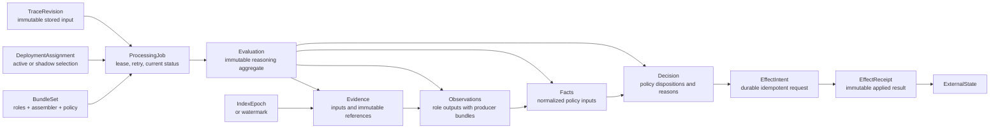
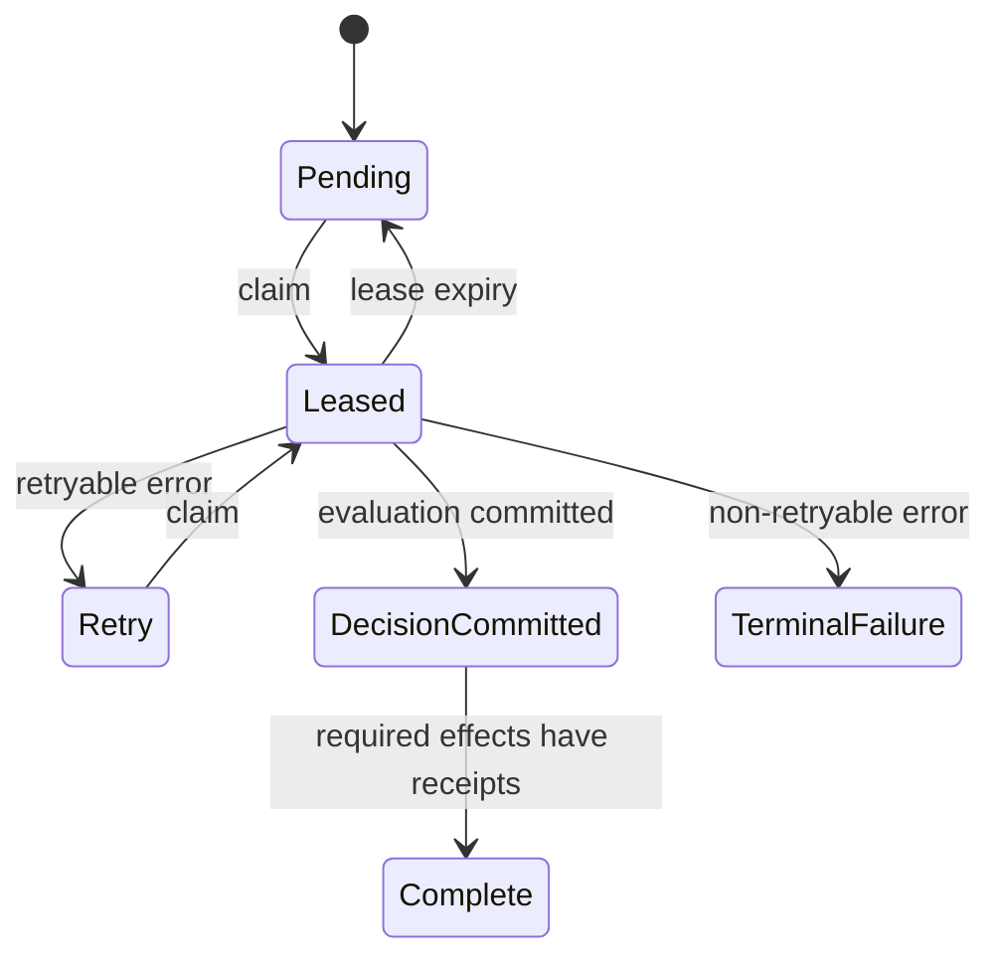

# Versioned Classifier Processing Design

> A minimal durable model for classifier evidence, observations, facts,
> decisions, and effects. The design supports safe retries, controlled
> reprocessing, policy evolution, and complete decision provenance.

- **Status:** Proposed target design
- **Date:** 2026-09-02
- **Scope:** Data model and processing workflow
- **Migration plan:** Not included

## Contents

1. [Motivation: current problems](#1-motivation-current-problems)
2. [High-level solution](#2-high-level-solution)
3. [New domain model](#3-new-domain-model)
4. [Rust pseudocode](#4-rust-pseudocode)
5. [New workflow model](#5-new-workflow-model)
6. [New database model](#6-new-database-model)
7. [Vector index model](#7-vector-index-model)
8. [System invariants](#8-system-invariants)


## 1. Motivation: current problems

The current schema grew through additive changes around specific classifiers.
It now mixes domain results, policy choices, workflow state, and external effects.

### No complete classifier identity

A score depends on a projection, model, configuration, calibration, and decision rule.
No single identifier binds all these parts.

### Schema and classifier coupling

Columns such as perplexity, tail fraction, and novelty encode one implementation.
New observations require new columns or changed field semantics.

### Mixed domain concepts

A gate row contains measurements, pass flags, evidence hashes, vector identifiers,
credit state, and later shadow scores.

### Mutable audit records

Some operations append decisions.
Other operations update the latest decision or add derived fields to old decision rows.

### Incomplete provenance

Gate decisions contain partial version stamps.
They do not identify the exact evidence, observations, facts, policy artifact,
and deployment selection.

### Effects occur inside classifiers

The current novelty path can insert vectors before the decision is durable.
A database error can leave unrecorded external state.

### Several vector planes

Gate novelty, general vector metadata, and shadow deduplication use separate paths.
Their roles and consistency rules are not explicit.

### No controlled reprocessing unit

A successful driver decision removes a trace from automatic work.
No run binds a trace revision to a complete bundle set.

> **Root problem:** The system cannot always identify the complete classifier
> and policy that produced a result. It also cannot always reproduce the result.


## 2. High-level solution

The new design separates immutable domain results from mutable operational state.
It persists only the boundaries needed for audit, recovery, and external effects.

### Complete version identity

Each processing job pins a bundle set and a deployment assignment.
Each result identifies its producer.

### Immutable evaluation

One evaluation records evidence, observations, facts, and a decision.
Reprocessing creates a new evaluation.

### Typed JSON documents

Variable classifier data uses JSONB with a schema identifier.
Stable identity and query fields remain relational.

### Minimal durable workflow

The database stores jobs, completed evaluations, effect intents, and effect receipts.
Telemetry records transient steps.

### Effects after decisions

The server persists an effect intent before it changes an external system.
An idempotency key makes retries safe.

### Explicit active selection

Deployment assignments select active and shadow bundle sets.
Timestamp order does not select production behavior.

### Durability principle

> **Persist domain results and irreversible boundaries.**
> Recompute transient pure processing.
> Send execution detail to logs, traces, and metrics.


### Non-requirements

- A database event for each internal workflow step.
- A separate database row for each temporary calculation.
- One physical vector backend for all vector roles.
- Raw trace bodies, vector arrays, or model log probabilities in PostgreSQL.
- Classifier-specific SQL columns for each new observation field.


## 3. New domain model

The core reasoning chain has five immutable concepts.
Operational records coordinate the chain and apply its result.

1. **Evidence** is the exact trace revision, projection, corpus snapshot,
  index epoch, and other input used for measurement.
2. **Observations** are raw outputs from classifier roles.
  Observations do not contain accept or reject policy.
3. **Facts** are normalized policy inputs assembled from observations by a
  versioned fact assembler.
4. **Decision** contains the desired dispositions produced by a pure,
  versioned policy from one fact set.
5. **Effect** records a requested state change and the result of applying it.
  A decision does not perform the effect.


### Supporting concepts


#### Trace revision

An immutable reference to one stored form of a trace.
A remediation or content change creates a new revision.

#### Classifier bundle

A content-addressed unit that identifies behavior, projection, model,
configuration, calibration, and output schemas.

#### Bundle set

A compatible set of role bundles, a fact assembler, and a policy.
Compatibility is validated before deployment.

#### Deployment assignment

A durable rule that selects a bundle set for a tenant, mode, and time range.
The processing job stores the resolved assignment.

#### Processing job

A mutable lease and retry record.
The job coordinates work but does not provide the audit history.

#### Evaluation

The immutable aggregate that contains the complete reasoning chain for one
trace revision and one bundle set.

#### Effect intent

A durable request to register a trace, insert a vector, issue credit,
schedule review, or apply another disposition.

#### Effect receipt

An immutable result from an applied effect.
It references external identifiers and contains a result hash.

### Relationship diagram




The evaluation contains the reasoning chain.
Operational records coordinate processing and external state changes.

### Provenance path

The model explains why an effect occurred through one directed chain:

```text
EffectReceipt
  → EffectIntent
  → Decision
  → Facts
  → Observations
  → Evidence
  → TraceRevision + BundleSet + IndexEpoch
```


## 4. Rust pseudocode


### Common identifiers

```rust
struct ClassifierId(String);
struct ProjectionId(String);
struct EvidenceId(String);
struct PolicyId(String);
struct BundleId(String);
struct ContentHash(String);
```


### Classifier

A Classifier measures one property. It produces an Observation, not a production Decision.

```rust
struct ClassifierDescriptor {
    id: ClassifierId,
    role: ClassifierRole,
    projection_id: ProjectionId,
    implementation_hash: ContentHash,
    output_schema: String,
}

enum ClassifierRole {
    TenantDuplication,
    GlobalDuplication,
    Novelty,
    Substance,
}

trait NoveltyClassifier: Send + Sync {
    fn descriptor(&self) -> &ClassifierDescriptor;

    fn observe(
        &self,
        input: &ProjectedTrace,
        evidence: &dyn NoveltyEvidenceView,
    ) -> Result<NoveltyObservation, ClassifierError>;
}
```

Example:

```rust
let classifier = BgeNoveltyClassifier {
    descriptor: ClassifierDescriptor {
        id: ClassifierId("novelty-bge-large-v1".into()),
        role: ClassifierRole::Novelty,
        projection_id: ProjectionId("rendered-events-v2".into()),
        implementation_hash: sha256("bge-large-code-and-weights"),
        output_schema: "novelty-observation-v1".into(),
    },
};
```


### Projection

A Projection converts a stored trace into the exact classifier input.

```rust
trait TraceProjection: Send + Sync {
    fn id(&self) -> &ProjectionId;

    fn project(
        &self,
        trace: &StoredTrace,
    ) -> Result<ProjectedTrace, ProjectionError>;
}

struct ProjectedTrace {
    projection_id: ProjectionId,
    content_hash: ContentHash,
    chunks: Vec<ProjectedChunk>,
}

struct ProjectedChunk {
    index: u32,
    text: String,
}
```

Example projection:

```rust
struct RenderedEventsV2;

impl TraceProjection for RenderedEventsV2 {
    fn id(&self) -> &ProjectionId {
        &ProjectionId("rendered-events-v2".into())
    }

    fn project(&self, trace: &StoredTrace) -> Result<ProjectedTrace, ProjectionError> {
        let chunks = trace.events
            .map(render_event)
            .pack_into_chunks(2_048);

        Ok(ProjectedTrace {
            projection_id: self.id().clone(),
            content_hash: sha256(&chunks),
            chunks,
        })
    }
}
```


### Evidence

Evidence is external state that a Classifier needs for one measurement.

Use typed evidence names in the real API. A generic `Evidence` type can hide important differences.

```rust
struct NoveltyEvidenceDescriptor {
    id: EvidenceId,
    reference_corpus_hash: ContentHash,
    index_snapshot_hash: ContentHash,
    member_count: u64,
}

trait NoveltyEvidenceView: Send + Sync {
    fn descriptor(&self) -> &NoveltyEvidenceDescriptor;

    fn nearest_neighbors(
        &self,
        embedding: &[f32],
        limit: usize,
    ) -> Result<Vec<Neighbor>, EvidenceError>;
}

struct Neighbor {
    member_hash: ContentHash,
    cosine_similarity_micros: i64,
}
```

Example:

```rust
let evidence = FrozenNoveltyIndex {
    descriptor: NoveltyEvidenceDescriptor {
        id: EvidenceId("novelty-index-2026-09-01".into()),
        reference_corpus_hash: sha256("approved-reference-corpus"),
        index_snapshot_hash: sha256("index-build"),
        member_count: 82_451,
    },
    index,
};
```


### Observation

An Observation is the raw output from one Classifier operation.

It includes provenance, measurements, and evidence identity.

```rust
struct NoveltyObservation {
    classifier_id: ClassifierId,
    projection_id: ProjectionId,
    evidence_id: EvidenceId,
    input_hash: ContentHash,

    representative_novelty_micros: u64,
    peak_novelty_micros: u64,
    nearest_similarity_micros: i64,
    neighbor_evidence_hash: ContentHash,
}
```

Example:

```rust
let observation = NoveltyObservation {
    classifier_id: ClassifierId("novelty-bge-large-v1".into()),
    projection_id: ProjectionId("rendered-events-v2".into()),
    evidence_id: EvidenceId("novelty-index-2026-09-01".into()),
    input_hash: sha256("projected-trace"),

    representative_novelty_micros: 720_000,
    peak_novelty_micros: 910_000,
    nearest_similarity_micros: 280_000,
    neighbor_evidence_hash: sha256("nearest-neighbors"),
};
```

The Observation does not contain `passed: true`. A Policy makes that judgment.

### Fact

A Fact states whether a required Observation is available.

It prevents the system from converting missing data into a favorable zero.

```rust
enum Fact<T> {
    Available(T),

    Unavailable {
        reason: MissingFactReason,
        evidence_hash: Option<ContentHash>,
    },
}

enum MissingFactReason {
    ClassifierUnavailable,
    EvidenceUnavailable,
    ProjectionMismatch,
    Timeout,
    InsufficientSamples,
}
```

Example:

```rust
let novelty_fact = Fact::Available(observation);

let substance_fact = Fact::Unavailable {
    reason: MissingFactReason::ClassifierUnavailable,
    evidence_hash: Some(sha256("model-endpoint-error")),
};
```


### Policy

A Policy converts Facts into a Decision.

```rust
struct ProductionPolicyV3 {
    id: PolicyId,

    novelty_floor_micros: u64,
    substance_floor_micros: u64,
    tenant_duplicate_limit_micros: u64,

    require_novelty: bool,
    require_substance: bool,
}

trait DecisionPolicy {
    fn id(&self) -> &PolicyId;

    fn decide(
        &self,
        facts: &DecisionFacts,
    ) -> Result<Decision, PolicyError>;
}
```

The combined facts are typed:

```rust
struct DecisionFacts {
    tenant_duplication: Fact<TenantDuplicationObservation>,
    global_duplication: Fact<GlobalDuplicationObservation>,
    novelty: Fact<NoveltyObservation>,
    substance: Fact<SubstanceObservation>,
    governance: GovernanceFacts,
}
```

Example policy logic:

```rust
fn decide(&self, facts: &DecisionFacts) -> Result<Decision, PolicyError> {
    let novelty = facts.novelty.require_available()?;
    let substance = facts.substance.require_available()?;

    let novelty_passed =
        novelty.representative_novelty_micros >= self.novelty_floor_micros;

    let substance_passed =
        substance.perplexity_micros >= self.substance_floor_micros;

    if !novelty_passed {
        return Ok(Decision::review("novelty_below_floor"));
    }

    if !substance_passed {
        return Ok(Decision::review("substance_below_floor"));
    }

    Ok(Decision::accept())
}
```


### Decision

A Decision records what production must do.

```rust
struct Decision {
    policy_id: PolicyId,
    facts_hash: ContentHash,

    registration: RegistrationDisposition,
    credit: CreditDisposition,
    index: IndexDisposition,

    reason_codes: Vec<String>,
}

enum RegistrationDisposition {
    Accept,
    Quarantine,
    Reject,
}

enum CreditDisposition {
    Eligible,
    Withhold,
}

enum IndexDisposition {
    AddToFutureSnapshot,
    DoNotAdd,
}
```

Example:

```rust
let decision = Decision {
    policy_id: PolicyId("production-policy-v3".into()),
    facts_hash: sha256(&facts),

    registration: RegistrationDisposition::Accept,
    credit: CreditDisposition::Eligible,
    index: IndexDisposition::AddToFutureSnapshot,

    reason_codes: vec!["all_required_classifiers_passed".into()],
};
```


### Bundle

A Bundle identifies the complete classifier and policy configuration.

```rust
struct ClassifierBundle {
    id: BundleId,

    tenant_duplication: ClassifierRef,
    global_duplication: ClassifierRef,
    novelty: ClassifierRef,
    substance: ClassifierRef,

    policy_id: PolicyId,
}

struct ClassifierRef {
    classifier_id: ClassifierId,
    projection_id: ProjectionId,
    calibration_id: String,
    artifact_hash: ContentHash,
}
```

Example:

```rust
let bundle = ClassifierBundle {
    id: BundleId("sha256:production-bundle-42".into()),

    tenant_duplication: classifier_ref("tenant-dup-v2"),
    global_duplication: classifier_ref("global-simhash-v1"),
    novelty: classifier_ref("novelty-bge-large-v1"),
    substance: classifier_ref("substance-qwen-v3"),

    policy_id: PolicyId("production-policy-v3".into()),
};
```

The Bundle does not contain mutable index contents. Each Observation records the exact Evidence snapshot it used.

### Complete example

```rust
let projected = projection.project(&stored_trace)?;

let observation = novelty_classifier.observe(
    &projected,
    &novelty_evidence,
)?;

let facts = DecisionFacts {
    tenant_duplication: Fact::Available(tenant_duplication),
    global_duplication: Fact::Available(global_duplication),
    novelty: Fact::Available(observation),
    substance: Fact::Available(substance),
    governance,
};

let decision = active_policy.decide(&facts)?;

server.persist_facts(&facts)?;
server.persist_decision(&decision)?;
server.apply_decision(&decision)?;
```

The responsibility chain is:

```text
Projection prepares input.
Evidence supplies comparison state.
Classifier produces an Observation.
Fact records availability.
Policy evaluates Facts.
Decision specifies production effects.
Bundle fixes the complete configuration.
```


## 5. New workflow model

The workflow persists two recovery boundaries.
Pure classifier work occurs between these boundaries and can restart after an error.

1. **Accept and queue.** Store the trace revision.
  Resolve the deployment.
   Create one processing job in the same database transaction.
2. **Compute in memory.** Load evidence.
  Produce observations.
   Assemble facts.
   Evaluate the policy.
   Do not apply external effects.
3. **Commit the decision.** Insert one immutable evaluation.
  Insert effect intents.
   Mark the job as decision committed.
4. **Apply effects.** Claim each effect.
  Apply it with its idempotency key.
   Insert a receipt and mark the effect complete.


### Processing job states




The state machine remains explicit in code.
The database does not store a separate event for each transition.

### `processing_jobs`

One mutable row coordinates execution:

```text
job_id
tenant_id
trace_revision_id
deployment_id
bundle_set_id
mode                    active | shadow | reprocess
state                   pending | leased | retry | decision_committed |
                        complete | terminal_failure
lease_owner
lease_expires_at
attempt_count
next_attempt_at
last_error_code
evaluation_id
created_at
updated_at
```

This row is an operational projection, not an audit record.

Workers claim jobs with a lease. If a process crashes, the lease expires and another worker recomputes the evaluation.

A unique key such as this prevents duplicate logical work:

```text
tenant + trace revision + deployment + bundle set + mode
```


### `evaluations`

On successful computation, write one immutable aggregate containing the complete reasoning chain:

```text
evaluation_id
job_id
trace_revision_id
deployment_id
mode

evidence_schema
evidence JSONB
evidence_hash

observations_schema
observations JSONB
observations_hash

facts_schema
facts JSONB
facts_hash

policy_bundle_id
decision_schema
decision JSONB
decision_hash

created_at
```

Each observation inside the document identifies its classifier bundle:

```json
{
  "role": "novelty",
  "classifier_bundle_id": "novelty-v4",
  "evidence_hash": "sha256:...",
  "schema": "trace-commons.novelty-observation.v2",
  "payload": {
    "novelty_micros": 640000,
    "index_epoch_id": "epoch-42"
  }
}
```

This preserves the conceptual chain:

```text
Evidence → Observations → Facts → Decision
```

without requiring one transaction per arrow.

The worker can compute all four stages in memory and insert the evaluation in one transaction.

### Completion transaction

When evaluation succeeds, one transaction should:

1. Insert the immutable evaluation.
2. Create required effect outbox records.
3. Mark the processing job `decision_committed`.
4. Update any current-state projection that can be changed atomically.

This gives all-or-nothing decision persistence.

For a shadow run, the transaction inserts the evaluation but creates no effects.

### Effects require separate durability

Effects are different because they cross a failure boundary.

Suppose the server inserts a vector and crashes before recording that insertion. Retrying could insert it twice. The same problem applies to credit issuance.

Use:

```text
effect_outbox
effect_receipts
```


#### `effect_outbox`

```text
effect_id
evaluation_id
decision_hash
effect_kind
payload JSONB
payload_hash
idempotency_key
status
attempt_count
next_attempt_at
last_error_code
created_at
updated_at
```

The requested payload is immutable. Retry fields are mutable operational state.

#### `effect_receipts`

Write an immutable receipt when the effect succeeds:

```text
receipt_id
effect_id
executor_bundle_id
external_resource_id
result JSONB
result_hash
applied_at
```

The resulting explanation chain is:

```text
effect receipt
  → effect intent
  → evaluation decision
  → facts
  → observations
  → evidence
  → trace revision and bundles
```

This is enough to answer why a credit or vector insertion happened.

### Crash and retry behavior


| Failure point             | Durable state                                | Recovery                                                                 |
| ------------------------- | -------------------------------------------- | ------------------------------------------------------------------------ |
| Before evaluation commit  | The trace revision and processing job exist. | The lease expires. Another worker recomputes the complete evaluation.    |
| After evaluation commit   | The evaluation and effect intents exist.     | The classifier does not run again. Effect workers continue the work.     |
| During an external effect | The effect intent and idempotency key exist. | The effect worker retries or queries the external system by key.         |
| After an effect succeeds  | The receipt identifies the external result.  | No recovery is necessary. A compensation uses a new decision and effect. |


### Selective checkpoints

The default workflow does not persist partial observations.
It recomputes them after a retry.

A classifier can use a content-addressed observation cache when recomputation
has high cost.
The cache key binds the bundle and exact evidence.

- Use a checkpoint for expensive or nondeterministic classifier calls.
- Use a checkpoint when independent services produce observations.
- Use a checkpoint when several policies reuse the same observation.
- Do not use a checkpoint for inexpensive deterministic calculations.


### Active, shadow, and reprocess modes

- **Active:** The evaluation creates effect intents after the policy decision.
- **Shadow:** The evaluation is durable, but it creates no production effects.
- **Reprocess:** A new job and evaluation reference an earlier evaluation.
Old records remain immutable.


### Workflow telemetry

Logs, traces, and metrics record lease renewals, model latency, retries,
and internal stage timing.
These details do not enter the audit model.

A small audit stream can record manual overrides, activation, rollback,
cancellation, terminal failure, and compensation.
Routine execution events do not require durable audit rows.

## 6. New database model

Stable identity, tenancy, status, and idempotency fields remain relational.
Evolving classifier content uses validated JSONB documents.

### Core tables


#### `classifier_bundles`

Immutable registry of classifier, assembler, and policy artifacts.
The bundle digest closes over behavior and dependencies.

#### `bundle_sets`

Immutable compatibility manifest for all roles used in one evaluation.

#### `deployment_assignments`

Time-bounded active and shadow selection by tenant scope.
The assignment provides deployment history and rollback identity.

#### `processing_jobs`

Mutable lease, retry, and completion projection.
This table is the work queue.

#### `evaluations`

Immutable JSONB aggregate for evidence, observations, facts, and the decision.

#### `effect_outbox`

Durable effect intent with mutable delivery state.
The requested payload remains immutable.

#### `effect_receipts`

Immutable result of a successful external or internal effect.

#### `vector_index_epochs`

Immutable novelty reference epochs and explicit generations for mutable online indexes.

### Illustrative SQL shape

These definitions show the model.
They are not a migration or final PostgreSQL syntax.

```sql
CREATE TABLE processing_jobs (
    tenant_id              text        NOT NULL,
    job_id                 uuid        NOT NULL,
    trace_revision_id      uuid        NOT NULL,
    deployment_id          uuid        NOT NULL,
    bundle_set_id          text        NOT NULL,
    mode                    text        NOT NULL,
    state                   text        NOT NULL,
    lease_owner_hash        text,
    lease_expires_at        timestamptz,
    attempt_count           integer     NOT NULL DEFAULT 0,
    next_attempt_at         timestamptz,
    last_error_code         text,
    evaluation_id           uuid,
    created_at              timestamptz NOT NULL,
    updated_at              timestamptz NOT NULL,

    PRIMARY KEY (tenant_id, job_id),
    UNIQUE (
        tenant_id,
        trace_revision_id,
        deployment_id,
        bundle_set_id,
        mode
    )
);

CREATE TABLE evaluations (
    tenant_id              text        NOT NULL,
    evaluation_id          uuid        NOT NULL,
    job_id                 uuid        NOT NULL,
    trace_revision_id      uuid        NOT NULL,
    deployment_id          uuid        NOT NULL,
    bundle_set_id          text        NOT NULL,
    mode                    text        NOT NULL,

    evidence_schema        text        NOT NULL,
    evidence               jsonb       NOT NULL,
    observations_schema    text        NOT NULL,
    observations           jsonb       NOT NULL,
    facts_schema           text        NOT NULL,
    facts                  jsonb       NOT NULL,
    policy_bundle_id       text        NOT NULL,
    decision_schema        text        NOT NULL,
    decision               jsonb       NOT NULL,

    evaluation_hash        text        NOT NULL,
    created_at              timestamptz NOT NULL,

    PRIMARY KEY (tenant_id, evaluation_id),
    UNIQUE (tenant_id, job_id)
);

CREATE TABLE effect_outbox (
    tenant_id              text        NOT NULL,
    effect_id              uuid        NOT NULL,
    evaluation_id          uuid        NOT NULL,
    effect_kind            text        NOT NULL,
    effect_schema          text        NOT NULL,
    payload                 jsonb       NOT NULL,
    payload_hash            text        NOT NULL,
    idempotency_key         text        NOT NULL,
    required                boolean     NOT NULL,
    status                  text        NOT NULL,
    attempt_count           integer     NOT NULL DEFAULT 0,
    next_attempt_at         timestamptz,
    last_error_code         text,
    created_at              timestamptz NOT NULL,
    updated_at              timestamptz NOT NULL,

    PRIMARY KEY (tenant_id, effect_id),
    UNIQUE (tenant_id, idempotency_key)
);

CREATE TABLE effect_receipts (
    tenant_id              text        NOT NULL,
    receipt_id             uuid        NOT NULL,
    effect_id              uuid        NOT NULL,
    executor_bundle_id     text        NOT NULL,
    external_resource_id   text,
    result_schema           text        NOT NULL,
    result                  jsonb       NOT NULL,
    result_hash             text        NOT NULL,
    applied_at              timestamptz NOT NULL,

    PRIMARY KEY (tenant_id, receipt_id),
    UNIQUE (tenant_id, effect_id)
);
```


### Job claim

```sql
WITH candidate AS (
    SELECT tenant_id, job_id
    FROM processing_jobs
    WHERE state IN ('pending', 'retry')
      AND next_attempt_at <= now()
    ORDER BY created_at
    FOR UPDATE SKIP LOCKED
    LIMIT 1
)
UPDATE processing_jobs AS job
SET state = 'leased',
    lease_owner_hash = $worker_hash,
    lease_expires_at = now() + $lease_duration,
    attempt_count = attempt_count + 1,
    updated_at = now()
FROM candidate
WHERE job.tenant_id = candidate.tenant_id
  AND job.job_id = candidate.job_id
RETURNING job.*;
```


### Evaluation commit

```sql
BEGIN;

INSERT INTO evaluations (...);

-- Active mode only. Insert zero rows for a shadow evaluation.
INSERT INTO effect_outbox (...);

UPDATE processing_jobs
SET state = 'decision_committed',
    evaluation_id = $evaluation_id,
    lease_owner_hash = NULL,
    lease_expires_at = NULL,
    updated_at = now()
WHERE tenant_id = $tenant_id
  AND job_id = $job_id
  AND state = 'leased';

COMMIT;
```


### Read models

Mutable views and projections support common queries.
These projections are not the decision audit source.

- The current processing state for each trace revision.
- The active evaluation under the current deployment assignment.
- Pending and expired job leases.
- Pending and retryable effects.
- Active and shadow decision differences.
- The full provenance chain for an effect receipt.


### JSONB rules

- Each JSONB document has a schema identifier and version.
- Application code validates the document before each write and read.
- A semantic field change creates a new schema version.
- Policies use typed decoded facts.
- Policies do not inspect arbitrary JSON paths.
- Large or sensitive evidence stays in encrypted object storage.
- The database stores references, hashes, and bounded safe metadata.


### Hash policy

The evaluation uses canonical JSON before hash calculation.
One final evaluation hash is sufficient for the minimal design.

A component receives its own hash only when another system reuses, signs,
caches, compares, or independently attests that component.

### Tenant isolation

Every table carries `tenant_id`.
PostgreSQL forces RLS on every tenant table.
Worker claims use narrow roles and bounded columns.

## 7. Vector index model

One control plane manages logical vector namespaces.
Different namespaces can use different physical backends and consistency rules.

### Novelty reference

This namespace uses immutable epochs.
Each observation references the exact epoch, corpus manifest, and embedding bundle.

### Online tenant deduplication

This namespace changes after accepted submissions.
Evidence records the state generation or watermark used by the successful attempt.

### Online global deduplication

This namespace supports anti-spam checks across tenants.
Its access policy and evidence surface remain separate from tenant novelty.

### Ranking features

This namespace supports downstream ranking.
It does not silently substitute for novelty or deduplication evidence.

### Required index records

```text
VectorNamespace
  namespace_id
  role
  tenant_scope
  backend_kind

VectorIndexEpoch
  epoch_id
  namespace_id
  embedding_bundle_id
  source_snapshot_id
  manifest_hash
  state: building | sealed | active | retired

VectorIndexMembership
  epoch_id
  trace_revision_id
  external_vector_id
  source_projection_hash
  inserted_by_effect_id
```

> **Classifier restriction:** A classifier can query an index, but it cannot
> insert into that index. A policy decision requests insertion through an
> effect intent.


## 8. System invariants

1. Each processing job pins one trace revision and one resolved bundle set.
2. Each evaluation is immutable.
3. Reprocessing creates a new job and evaluation.
4. Each document has a schema identifier.
5. Each observation identifies its classifier bundle.
6. Each fact set identifies its assembler bundle.
7. Each decision identifies its policy bundle and exact fact set.
8. Only active evaluations create production effect intents.
9. The database stores each external effect intent before application.
10. Each effect has a stable idempotency key.
11. Each successful effect has an immutable receipt.
12. Each novelty observation identifies an index epoch or state watermark.
13. Missing required evidence causes a closed decision or processing error.
14. Current state is a projection. It is not an overwritten audit record.
15. Classifier-specific fields remain inside validated JSONB documents.


### Result

The system can explain every durable effect without recording each internal
workflow step.
It can also retry incomplete work from the stored trace revision.

The model supports new classifiers and policies without classifier-specific
database columns.
Schema versions preserve the meaning of historical documents.